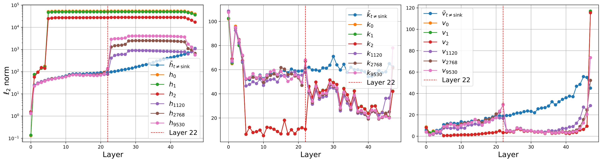

<h1 align="center">On the Existence and Behavior of Secondary Attention Sinks</h1>
<p align="center">
	<a href="https://arxiv.org/abs/2512.22213"></a>
	<a href="https://huggingface.co/papers/2512.22213"></a>
	<a href="https://github.com/JeffreyWong20/Secondary-Attention-Sinks"></a>
	<a href="https://github.com/JeffreyWong20/Secondary-Attention-Sinks/issues"></a>
  </p>


---

<p align="center">
	<a href="assert/hkv-deepseek-14b-sample23-chat-template_log.png">
		
	</a>
</p>

---

Analyze and visualize **secondary attention sinks** in open LLMs by:

- generating math responses,
- detecting sink tokens from hidden-state similarity to BOS,
- collecting layer-level activations,
- and running PCA / directional analyses.

This repo contains scripts and notebooks used for sink detection and interpretation experiments.

---

## News

- **[2026]** This paper was accepted to the **ICLR 2026 Workshop on Unifying Concept Representation Learning**.

---

## Project Structure

```text
Secondary_Attention_Sinks/
├── src/
│   ├── run_math_vllm.py       # Generation with vLLM
│   ├── hidden_state_base.py   # Sink detection from hidden states
│   ├── patch_base.py          # Layer/state collection with hooks
│   ├── mlp_base.py            # MLP-direction similarity analysis
│   ├── attn_base.py           # Attention weight collection
│   └── utils.py               # Model registry + utility functions
├── data/                      # Input datasets (jsonl)
├── outputs/                   # Model generations
├── results/                   # Sink detection + analysis outputs
├── 01.hidden_k_v_norm.ipynb
├── 02.hierarchical_levels.ipynb
├── 03.a.print_sink_direction.ipynb
├── 03.b.perform_clustering.ipynb
├── 04.pca.ipynb
└── 05.sink_score.ipynb
```

---

## Environment Setup

```bash
conda create -n sink python=3.11 -y
conda activate sink
pip install -r requirements.txt
```

### Optional HF cache setup

```bash
export HF_HOME=/data/models
export TRANSFORMERS_CACHE=$HF_HOME
export HF_DATASETS_CACHE=$HF_HOME
```

---

## End-to-End Pipeline

### 1) Generate responses with vLLM

```bash
CUDA_VISIBLE_DEVICES=0 python3 ./src/run_math_vllm.py \
	--dataset_path ./data/aime24.jsonl \
	--save_path ./outputs/aime24/vllm/output_n_10_deepseek-14b.jsonl \
	--model_short_name deepseek-14b \
	--max_length 16384 \
	--eval_batch_size 1 \
	--n_gen 10 \
	--temperature 0 \
	--use_chat_template
```

Notes:

- Supported dataset names are inferred from filename: `aime24`, `gsm8k`, `math`.
- You can also pass `--model_path` directly instead of `--model_short_name`.

### 2) Detect secondary sinks from hidden states

```bash
model_short_name=deepseek-14b
python3 ./src/hidden_state_base.py \
	--model_short_name $model_short_name \
	--file_path ./outputs/aime24/vllm/output_n_10_deepseek-14b.jsonl \
	--output_dir ./results/sink_detection \
	--gpu_id 0 \
	--sample_num 30 \
	--use_chat_template
```

Output file:

```text
./results/sink_detection/<model_short_name>/sink_detection_<model_short_name>_use_chat_template.jsonl
```

### 3) (Optional) Collect per-layer states for selected samples

```bash
model_short_name=deepseek-14b
sample_index=4

python3 ./src/patch_base.py \
	--model_short_name $model_short_name \
	--file_path ./outputs/aime24/vllm/output_n_10_deepseek-14b.jsonl \
	--output_dir ./results/sink_detection \
	--gpu_id 0 \
	--sample_index $sample_index \
	--collector_targets residual k v \
	--use_chat_template
```

### 4) Analyze MLP directional similarity around sink layers

```bash
model_short_name=deepseek-14b
dataset=aime24

python3 ./src/mlp_base.py \
	--model_short_name $model_short_name \
	--dataset $dataset \
	--file_path ./outputs/${dataset}/vllm/output_n_10_deepseek-14b.jsonl \
	--output_dir ./results/sink_detection \
	--gpu_id 0 \
	--sink_info_path ./results/sink_detection/${model_short_name}/sink_detection_${model_short_name}_use_chat_template.jsonl \
	--sample_num 30 \
	--use_chat_template
```

---

## Notebook Guide

Each notebook now includes a short setup block in its first cell. The summary below mirrors those inputs and explains how the notebooks connect.

### 1) `01.hidden_k_v_norm.ipynb` — Reproduce Figure 1

Purpose:
- Plot key, value, and hidden-state norms for BOS sinks and secondary sinks.

Required inputs:
- `sink_detection_info_path`: sink detection results from `./src/hidden_state_base.py`.
- `kv_hidden_states_path`: hooked residual/key/value states from `./src/patch_base.py`.

Typical workflow:
- Generate responses with `./src/run_math_vllm.py`.
- Detect sinks with `./src/hidden_state_base.py`.
- Collect hooked tensors with `./src/patch_base.py` using `--collector_targets residual k v`.

### 2) `02.hierarchical_levels.ipynb` — Reproduce Figure 2

Purpose:
- Visualize sink levels across models using creation layer $l_{\text{start}}$ and lifetime.

Required input:
- `sink_detection_info_path`: sink detection results from `./src/hidden_state_base.py`.

Output:
- A cross-model heatmap saved under `./results/sink_detection/life_time_vs_creation_layer_across_models.pdf`.

### 3) `03.a.print_sink_direction.ipynb` — Collect data for Figure 6

Purpose:
- Collect intermediate hidden states, MLP outputs, and attention outputs for clustering analysis.

Required inputs:
- `file_path`: model generations from `./outputs/aime24/vllm/`.
- `sink_info_path`: sink detection results from `./src/hidden_state_base.py`.

Notes from the notebook:
- Recommended paper setting: `n_gen=10`, `target_layer_idx=17` to `22`, and `sample_num=10`.
- Each target layer takes roughly 6 minutes and around 4.8 GB of storage.
- The notebook collects one layer at a time to reduce memory usage.

This notebook produces the activation files consumed by the clustering and PCA notebooks below.

### 4) `03.b.perform_clustering.ipynb` — Reproduce Figure 6 clustering results

Purpose:
- Run clustering and low-dimensional visualization on the tensors collected in `03.a.print_sink_direction.ipynb`.

Required input:
- `file_path`: `./results/example/attn_output_residual_mlp_pt/creation_layer_info_dict_deepseek-14b_n_{n_gen}_other_{target_layer_idx}.pt`

Notes:
- The notebook loops over `layer_range = range(17, 23)` by default.
- It compares `residual`, `attn_output`, and `mlp_input` representations.

### 5) `04.pca.ipynb` — Reproduce Figure 5

Purpose:
- Perform PCA analysis on collected layer data to study variance directions associated with secondary sinks.

Required input:
- `layer_22_path`: `./results/example/creation_layer_info_dict_deepseek-14b_n_{n_gen}_other_22.pt`

Notes:
- The notebook focuses on layer 22, which is highlighted as a frequent creation layer for secondary attention sinks in `deepseek-14b`.

### 6) `05.sink_score.ipynb` — Reproduce Figure 7

Purpose:
- Analyze sink score strength and sink lifetime across layers.

Required inputs:
- `file_path`: `./outputs/aime24/vllm/output_n_1_deepseek-14b.jsonl`
- `attn_weight_path`: `./results/example/attn_weight_pt`
- `mlp_weight_path`: `./results/example/attn_output_residual_mlp_pt`

Notes:
- Attention-weight tensors are collected from `attn_base.py`.
- MLP-related tensors are produced by the Figure 6 data collection workflow.

Terminology used in notebooks:

- **cliff**: identified secondary sink tokens.
- **other**: tokens with the same token IDs as cliff tokens but not identified as sinks.

---

## Supported Model Short Names

Model aliases are defined in `src/utils.py` (`MODEL_DICT`) and include families such as:

- DeepSeek-R1 Distill (`deepseek-1.5b`, `deepseek-7b`, `deepseek-14b`, ...)
- Qwen / Qwen2 / Qwen2.5 / Qwen3 variants
- Llama variants
- Phi variants
- other research backbones listed in the mapping

If needed, bypass aliases by passing `--model_path <hf_repo_id>`.

---

## Practical Tips

- Keep `--use_chat_template` consistent between generation and downstream analysis.
- Long contexts can be memory-heavy; use smaller `--sample_num` first.
- Some scripts cap sequence length for larger models (for stability/OOM avoidance).
- Prefer one analysis stage at a time and clear CUDA memory between runs.

---

## Cleanup

```bash
conda deactivate
conda remove --name sink --all
```
